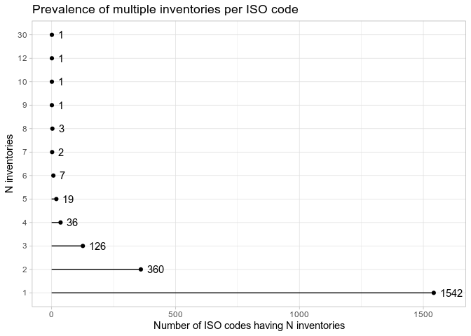

-   [Introduction](#introduction)
    -   [How do I get the data?](#how-do-i-get-the-data)
-   [Inventories, language codes, doculects, and
    sources](#inventories-language-codes-doculects-and-sources)
    -   [How are PHOIBLE inventories
        created?](#how-are-phoible-inventories-created)
    -   [Why do some phonological inventories combine more than one
        doculect?](#why-do-some-phonological-inventories-combine-more-than-one-doculect)
    -   [Where do the language codes in PHOIBLE come
        from?](#where-do-the-language-codes-in-phoible-come-from)
    -   [Missing isocodes](#missing-isocodes)
    -   [Why do some languages have multiple entries in
        PHOIBLE?](#why-do-some-languages-have-multiple-entries-in-phoible)
    -   [Why are multiple inventories sometimes linked to the same
        document?](#why-are-multiple-inventories-sometimes-linked-to-the-same-document)
    -   [What are the different “sources” in
        PHOIBLE?](#what-are-the-different-sources-in-phoible)
-   [Filtering and sampling](#filtsamp)
    -   [Random sampling: one inventory per
        isocode/glottocode](#random-sampling-one-inventory-per-isocodeglottocode)
    -   [Filtering by data source](#filtering-by-data-source)
    -   [Filtering and sampling based on inventory
        properties](#filtering-and-sampling-based-on-inventory-properties)
-   [Integrating geographic
    information](#integrating-geographic-information)
-   [Phonological features in
    PHOIBLE](#phonological-features-in-phoible)
-   [How is PHOIBLE used in academic research and/or
    industry?](#how-is-phoible-used-in-academic-research-andor-industry)
-   [References](#references)

Introduction
============

This FAQ answers questions regarding the editorial principles and design
decisions that went into the creation of PHOIBLE. We appreciate and
welcome feedback regarding these FAQs via [our issue
tracker](https://github.com/phoible/dev/issues) or by contacting the
editors directly.

When relevant, we provide [R](https://www.r-project.org/) code snippets
to elucidate the questions raised in this FAQ. To run these code
snippets requires the following [R
packages](https://cran.r-project.org/web/packages/available_packages_by_name.html):

``` r
library(readr)
library(stringr)
library(dplyr)
library(knitr)
library(ggplot2)
```

This document was rendered with R version 4.0.3 (2020-10-10) and package
versions dplyr: 1.0.2, readr: 1.4.0, stringr: 1.4.0, knitr: 1.30,
ggplot2: 3.3.2.

How do I get the data?
----------------------

You can get the most recent “official” release from our [download
page](https://phoible.org/download), get the most current version (with
bugfixes or new additions since last release) from
[GitHub](https://github.com/phoible/dev/blob/master/data/phoible.csv?raw=true),
or use the following code snippet to download the most current version
from GitHub directly within `R`:

``` r
url_ <- "https://github.com/phoible/dev/blob/master/data/phoible.csv?raw=true"
col_types <- cols(InventoryID='i', Marginal='l', .default='c')
phoible <- read_csv(url(url_), col_types=col_types)
```

Inventories, language codes, doculects, and sources
===================================================

How are PHOIBLE inventories created?
------------------------------------

For the most part, every phonological inventory in PHOIBLE is based on
one-and-only-one language description (usually a research article, book
chapter, dissertation, or descriptive grammar). The technical term for
this in comparative linguistics is “doculect” (from “documented lect”),
in which [lect](https://en.wikipedia.org/wiki/Variety_(linguistics))
means a specific form of a language or dialect, i.e. an instance of
documentation of an instance of linguistic behavior at a particular time
and place (Cysouw & Good, 2013). A brief explanation and some history of
why linguists use the term “doculect,” which has gained broad acceptance
in light of the issues of language identification and the use of
“language codes,” is given in [this blog
post](https://dlc.hypotheses.org/623) by Michael Cysouw.

Contributors to PHOIBLE start with a doculect, extract the contrastive
phonemes and allophones, and (if necessary) adapt the authors’ choice of
symbols to align with PHOIBLE’s [symbol
guidelines](http://phoible.github.io/conventions/). If the authors have
not provided ISO 639-3 and Glottolog codes, these are determined before
adding the inventory to PHOIBLE. Each inventory is then given a unique
numeric ID. Doculects are tracked in PHOIBLE using BibTeX keys.

Why do some phonological inventories combine more than one doculect?
--------------------------------------------------------------------

An exception to the “one doculect per inventory” rule arises for
inventories that were originally part of a curated phonological database
such as UPSID (Maddieson, 1984; Maddieson & Precoda, 1990) or SPA
(Crothers, Lorentz, Sherman, & Vihman, 1979). In those collections,
inventories were often based on multiple descriptions of linguistic
behavior, written by different linguists; those descriptions were
believed to be describing the same language, and disagreements between
the descriptions were adjudicated by the experts who compiled the
collection.

We can quickly see how many of PHOIBLE’s inventories are based on
multiple doculects by looking at the mapping table between PHOIBLE
inventory IDs and BibTeX keys:

``` r
url_ <- "https://github.com/phoible/dev/blob/master/mappings/InventoryID-Bibtex.csv?raw=true"
id_to_bibtex_mapping <- read_csv(url(url_), col_types=cols(InventoryID='i',
                                                           .default='c'))

id_to_bibtex_mapping %>%
    group_by(InventoryID) %>%
    tally(name="Number of doculects consulted") %>%
    group_by(`Number of doculects consulted`) %>%
    count(name="Number of inventories") %>%
    kable()
```

| Number of doculects consulted | Number of inventories |
|------------------------------:|----------------------:|
|                             1 |                  2435 |
|                             2 |                   442 |
|                             3 |                    93 |
|                             4 |                    29 |
|                             5 |                    10 |
|                             6 |                     7 |
|                             7 |                     2 |
|                             9 |                     1 |
|                            11 |                     1 |

Clearly, the majority of inventories in PHOIBLE represent a phonological
description from a single doculect. But it seems strange that a single
phonological inventory in PHOIBLE could be based on 11 different
doculects. Let’s examine it:

``` r
id_to_bibtex_mapping %>%
    group_by(InventoryID) %>%
    tally(name="Number of doculects consulted") %>%
    filter(`Number of doculects consulted` == 11) %>%
    pull(InventoryID) ->
    this_inventory_id

phoible %>%
    filter(InventoryID == this_inventory_id) %>%
    distinct(Source, LanguageName, Glottocode, ISO6393) %>%
    kable()
```

| Glottocode | ISO6393 | LanguageName | Source |
|:-----------|:--------|:-------------|:-------|
| haus1257   | hau     | HAUSA        | upsid  |

As we can see, this inventory represents a description of
[Hausa](https://glottolog.org/resource/languoid/id/haus1257) and was
added to PHOIBLE from the UPSID database (Maddieson, 1984; Maddieson &
Precoda, 1990). To understand why this UPSID entry consulted 11
different sources, consider first that Hausa is typologically
interesting (e.g., it has both ejective and implosive phonation
mechanisms) and has tens of millions of speakers, making it relatively
well-studied (the [Glottolog](https://glottolog.org/) reference catalog
has [more than 1400
references](https://glottolog.org/resource/languoid/id/haus1257) related
to Hausa).

Second, note that Maddieson’s work on UPSID involved “typologizing”
phonological inventories from different doculects, so that they were
comparable across all entries in his database (cf. Hyman, 2008).
Maddieson’s work was groundbreaking at the time because he was the first
typologist to generate a stratified language sample aimed at being
genealogically balanced, i.e. for each language family he chose one
representative language. This allowed Maddieson to make statements about
the cross-linguistic distribution of contrastive speech sounds with some
level of statistical confidence. In fact, much about what we know about
the distribution of the sounds of the world’s languages is due to
Maddieson’s original language sample and his meticulous curation of the
data.

Where do the language codes in PHOIBLE come from?
-------------------------------------------------

Every phonological inventory in PHOIBLE has a unique numeric inventory
ID. Since most PHOIBLE inventories (aside from some UPSID or SPA ones,
as mentioned above) are based on a single document, it is fairly
straightforward to link each PHOIBLE inventory to [the
Glottolog](https://glottolog.org/), which provides links between
linguistic description documents and unique identifiers for dialects,
languages, and groupings of dialects and languages at various levels
(the preferred term for any of these levels of specificity / grouping is
“languoid”; see Cysouw & Good, 2013). Thus in PHOIBLE each inventory
typically corresponds to a single languoid, and in most cases that
languoid is a “leaf node” in the Glottolog tree, i.e., it represents a
particular dialect known to be used at a particular place and time
(rather than a group of dialects, a language, or a language family).
However, in the few cases where multiple document sources were consulted
for an inventory, it may not be possible to link that inventory to a
unique Glottolog leaf node. In such cases, the inventory in PHOIBLE is
linked to the lowest possible Glottolog node that dominates the leaf
nodes of each source document.

For example, inventory 298 describes the Dan language, and was ingested
from UPSID and ultimately based on a single journal article. At the time
UPSID was compiled, Dan and Kla-Dan were considered a single language
(isocode `daf`) but in 2013 a proposal was accepted to assign them
separate isocodes (`dnj` and `lda`, respectively). Since it is unknown
whether the consultants for the doculect were speakers of what we would
now call “Dan” or “Kla-Dan,” the inventory is labeled with the old
isocode `daf` and linked to the corresponding non-leaf node in the
glottolog (`dann1241`).

In addition to providing Glottolog languoid codes (“glottocodes”) for
each inventory, PHOIBLE also includes [ISO
639-3](https://en.wikipedia.org/wiki/ISO_639-3) language codes
(“isocodes”) for each inventory. The link between glottocodes and
isocodes is maintained and provided by Glottolog. This situation can
result in two possible problems:

-   When there are [updates to ISO
    639-3](https://iso639-3.sil.org/code_changes/submitting_change_requests),
    the Glottolog may not update its mapping immediately, so the two can
    get out of sync temporarily. Such problems are typically resolved
    with new version releases of Glottolog.

-   In some cases, the editors of the Glottolog do not agree with the
    language classification choices of ISO 639-3 (see again the
    above-mentioned [blog post by
    Cysouw](https://dlc.hypotheses.org/623)). This disagreement results
    in cases where PHOIBLE must choose whether to accept the official
    ISO 639-3 code assignment, or use the isocode that the Glottolog
    associates with the glottocode for that inventory. In such cases,
    PHOIBLE policy is to report the ISO 639-3 version of the isocode.
    Consequently, there are a few languoids for which PHOIBLE and the
    Glottolog will report different isocodes for the same glottocode. If
    this is a problem for your analysis, you can always download a
    glottocode-isocode mapping from the Glottolog and merge it into the
    PHOIBLE dataset before performing your isocode-based analyses.

Missing isocodes
----------------

There are cases of languages reported in the Glottolog for which there
exists no isocode. For example, the Vach-Vasjugan variety of
[Khanty](https://en.wikipedia.org/wiki/Khanty_language) is a Uralic
language classified in the Glottolog as
[vach1239](https://glottolog.org/resource/languoid/id/vach1239).
However, [SIL](https://www.sil.org/) only assigns an isocode for one
variety of Northern Khanty (isocode `kca`, glottocode `khan1273`), and
because SIL is the Registration Authority of [ISO
639-3](https://iso639-3.sil.org/), Vach-Vasjugan Khanty has not been
assigned its own isocode distinct from Northern Khanty.

When no isocode exists for a particular phonological inventory in
PHOIBLE, as in the Vach-Vasjugan example above, PHOIBLE follows the
recommended practice of using the isocode `mis` (“missing”) to denote
that the language is not included in the ISO 639-3 standard. In PHOIBLE
these are these inventories with missing isocodes:

``` r
phoible %>%
    filter(ISO6393 == "mis") %>%
    distinct(InventoryID, LanguageName, ISO6393, Glottocode) %>%
    kable()
```

| InventoryID | Glottocode | ISO6393 | LanguageName      |
|------------:|:-----------|:--------|:------------------|
|        2143 | pisa1245   | mis     | Pisamira          |
|        2352 | lizu1234   | mis     | Lizu              |
|        2388 | east2773   | mis     | Dolakha Newar     |
|        2420 | zhon1235   | mis     | Zhongu Tibetan    |
|        2434 | vach1239   | mis     | Eastern Khanty    |
|        2450 | fore1274   | mis     | Forest Nenets     |
|        2691 | mink1237   | mis     | Minkin            |
|        2714 | guwa1244   | mis     | Guwar             |
|        2729 | NA         | mis     | Djindewal         |
|        2748 | mith1236   | mis     | Mithaka           |
|        2773 | cola1237   | mis     | Kolakngat         |
|        2778 | yari1243   | mis     | Yari-Yari         |
|        2782 | west2443   | mis     | East Djadjawurung |
|        2783 | djad1246   | mis     | Jardwadjali       |
|        2792 | kera1256   | mis     | Keramin           |
|        2793 | lowe1402   | mis     | Ngayawang         |
|        2794 | ngin1247   | mis     | Ngintait          |
|        2818 | gudj1237   | mis     | Gudjal            |
|        2882 | kawa1290   | mis     | Ogh Awarrangg     |
|        2883 | kawa1290   | mis     | Ogh Unyjan        |
|        2907 | wala1263   | mis     | Walangama         |
|        2911 | tyan1235   | mis     | Thaynakwithi      |
|        2913 | luth1234   | mis     | Luthigh           |
|        2914 | mbiy1238   | mis     | Mbiywom           |
|        2916 | ngko1236   | mis     | Ngkoth            |
|        2920 | yadh1237   | mis     | Yadhaykenu        |
|        2946 | bula1255   | mis     | Bularnu           |
|        2956 | yulp1239   | mis     | Yulparija         |
|        2988 | west2443   | mis     | West Djadjawurung |
|        2999 | sout2770   | mis     | Ngunawal          |

Many of these inventories come from [Erich
Round’s](https://languages-cultures.uq.edu.au/profile/1160/erich-round)
[contribution of Australian phonemic
inventories](https://zenodo.org/record/3464333#.XyK5qxMzY3E) to PHOIBLE.
Unfortunately, some of these languages are extinct and have no
representation in the [Ethnologue](https://www.ethnologue.com/), and
hence, no code assigned in ISO 639-3.

For users, it is important to note that multiple phonological
inventories in PHOIBLE may have the same isocode (e.g. “mis”) or the
same glottocode (e.g., in cases of two different descriptions of the
same lect). In essence, this means that any programmatic code that
groups by isocode or glottocode risks combining inventories from
different doculects into a single apparent inventory. This could lead to
incorrect results (e.g., if the goal is to count the number of
phonemes). Therefore, **most analyses of inventory properties should be
done on the level of inventory IDs** rather than isocodes or
glottocodes. See also the [section on filtering and sampling](#filtsamp)
below.

Why do some languages have multiple entries in PHOIBLE?
-------------------------------------------------------

It is not uncommon that phonological descriptions of a particular
language’s speech sounds have different sets of contrastive phonemes
when analyzed by different linguists (or sometimes even by the same
linguist throughout their career). For example,
[Kabardian](https://en.wikipedia.org/wiki/Kabardian_language) is
represented in PHOIBLE by [five distinct
inventories](https://phoible.org/languages/kaba1278).

``` r
phoible %>%
    filter(ISO6393 == "kbd") %>%
    group_by(InventoryID) %>%
    summarise(`Number of phonemes`=n(),
              Phonemes=str_c(Phoneme, collapse=" "),
              .groups="drop") %>%
    kable()
```

| InventoryID | Number of phonemes | Phonemes                                                                                                                                                              |
|------------:|-------------------:|:----------------------------------------------------------------------------------------------------------------------------------------------------------------------|
|           4 |                 56 | b d̻ d̻z̻ f fʼ j kʷʰ kʷʼ k̟ʲʰ k̟ʲʼ m n̻ pʰ pʼ qχ qχʷ qχʷʼ qχʼ r s̻ t̻s̻ t̻s̻ʼ t̻ʰ t̻ʼ v w xʷ x̟ʲ z̻ ç̟ ħ ɡʷ ɡ̟ʲ ɣ̟ʲ ɦ ɬʲ ɬʲʼ ɮʲ ʁ ʁʷ ʃ ʃʼ ʒ ʔ ʔʷ ʕ ʝ̟ χ χʷ a̟ː e̞ː iː o̞ː uː ɜ ɨ            |
|         391 |                 56 | b d̪ d̪z̪ f fʼ j kʲʰ kʲʼ kʷʰ kʷʼ m n̪ pʰ pʼ qʷʼ qʼ qχ qχʷ r s̪ t̪s̪ t̪s̪ʼ t̪ʰ t̪ʼ v w xʲ xʷ z̪ ħ ɡʲ ɡʷ ɣʲ ɦ ɬ̪ʲ ɬ̪ʲʼ ɮ̪ʲ ʁ ʁʷ ʃ ʃʼ ʃ͇ ʒ ʒ͇ ʔ ʔʷ ʕ χ χʷ a̟ː e̞ː iː o̞ː uː ɜ ɨ              |
|        2310 |                 55 | b d dz d̠ʒ f fʼ j kʷ kʷʼ m n p pʼ q qʷ qʷʼ qʼ r s t ts tsʼ tʼ t̠ʃ t̠ʃʼ v w x xʷ z ħ ɡʷ ɣ ɬ ɬʼ ɮ ʁ ʁʷ ʃ ʆ ʆʼ ʒ ʓ ʔ ʔʷ χ χʷ ä e̞ː iː o̞ o̞ː uː ɑː ə                           |
|        2401 |                 63 | b d dz dʑ f fʼ j kʷ kʷʼ kʼ l m n p pʼ q qʷ qʷʼ qʼ r s t ts tsʷʼ tsʼ tɕ tɕʼ tʷʼ tʼ t̠ʃ t̠ʃʼ v w x xʷ z zʷ ħ ɕ ɡʷ ɣ ɬ ɬʼ ʁ ʁʷ ʃ ʆ ʆʼ ʑ ʒ ʓ ʔ ʔʷ χ χʷ ä e̞ː iː o̞ o̞ː uː ɑː ə |
|        2610 |                 51 | b d dz f fʼ h j kʲʼ kʷʰ kʷʼ l m n pʰ pʼ qʰ qʷʰ qʷʼ qʼ s ts tsʼ tʰ tʼ w xʷ z ç ħ ɡʲ ɡʷ ɬ ɬʼ ɾ ʁ ʁʷ ʃ ʃʼ ʒ ʔ ʔʷ ʝ χ χʷ äː eː iː oː uː ɐ ə                               |

The differences among them can be due to a variety of reasons, but the
main reason is that these phonological descriptions represent different
doculects (i.e., different instances of linguistic behavior at different
places, times, or with different speakers). This should probably not
surprise most linguists, since it has long been known that phoneme
analysis is a non-deterministic process (Chao, 1934; Hockett, 1963). See
Moran (2012, ch. 2.3.3) for a general discussion, and Hyman (2008, p.
99) for a detailed discussion of Kabardian in particular.

In light of the above discussion, it should come as no surprise that
PHOIBLE can contain multiple inventories for “the same” languoid,
depending on what kind of languoid you’re interested in. All it takes is
the existence of two or more descriptive documents associated with the
same group of speakers, where “group of speakers” is ultimately
determined by your desired level of granularity. To give a concrete
example, one researcher may be interested in comparing lects at the
“language” level, and so might wish to treat all inventories of
“English” as duplicates for the purposes of her analysis (regardless of
any differences in regional dialect or sociolect represented in the
original doculects and encoded in the phonological inventory). That
researcher might *filter* or *sample* PHOIBLE’s inventories to include
only one inventory for each isocode (how she chooses to implement that
filter is a separate question; see “How can I filter or sample
inventories?” for examples). Other researchers may not care about
“duplicates” in that sense, and may choose to include all inventories in
their analysis (or, they may filter the dataset to include only
inventories with a particular feature of interest such as breathy-voiced
vowels).

Below is a summary of the number of isocodes that are represented by
multiple inventories in PHOIBLE:

``` r
offset <- 25
phoible %>%
    group_by(ISO6393) %>%
    summarise(y=n_distinct(InventoryID), .groups="drop") %>%
    count(y) ->
    counts
counts %>%
    ggplot(aes(y=as.factor(y), x=n)) +
    geom_point() +
    geom_text(aes(x=n+offset, label=n), hjust=0) +
    geom_segment(aes(xend=0, yend=as.factor(y))) +
    xlim(NA, max(counts$n) + 2*offset) +
    theme_light() +
    labs(title="Prevalence of multiple inventories per ISO code",
         x="Number of ISO codes having N inventories",
         y="N inventories")
```

<!-- -->

So most ISO 639-3 codes have only 1 inventory (the long, bottom line).

Here is the same representation, for glottocodes instead of isocodes:

``` r
offset <- 25
phoible %>%
    group_by(Glottocode) %>%
    summarise(y=n_distinct(InventoryID), .groups="drop") %>%
    count(y) ->
    counts
counts %>%
    ggplot(aes(y=as.factor(y), x=n)) +
    geom_point() +
    geom_text(aes(x=n+offset, label=n), hjust=0) +
    geom_segment(aes(xend=0, yend=as.factor(y))) +
    xlim(NA, max(counts$n) + 2*offset) +
    theme_light() +
    labs(title="Prevalence of multiple inventories per glottocode",
         x="Number of glottocodes having N inventories",
         y="N inventories")
```

<!-- -->

Again, most glottocodes are represented by just one or two inventories
in PHOIBLE. Let’s see the few glottocodes that have the most
inventories:

``` r
phoible %>%
    group_by(Glottocode) %>%
    summarise(Names=str_c(unique(LanguageName), collapse=", "),
              `Number of inventories`=n_distinct(InventoryID),
              .groups="drop") %>%
    arrange(desc(`Number of inventories`)) %>%
    filter(`Number of inventories` > 5) %>%
    kable()
```

| Glottocode | Names                                                                                                                                     | Number of inventories |
|:-----------|:------------------------------------------------------------------------------------------------------------------------------------------|----------------------:|
| osse1243   | Ossetian, Iron Ossetic                                                                                                                    |                    11 |
| biri1256   | Barna, Biri, Garingbal, Miyan, Wiri, Yambina, Yangga, Yilba, Yuwi, Wangan                                                                 |                    10 |
| stan1293   | English, English (American), American English, English (Australian), English (British), English (New Zealand)                             |                     9 |
| dutc1256   | Dutch                                                                                                                                     |                     8 |
| kham1282   | Rgyalthang Tibetan, Brag-g.yab Tibetan, Nangchenpa Tibetan, Soghpo Tibetan, Kami Tibetan, Sangdam Tibetan, Dongwang Tibetan, Kham Tibetan |                     8 |
| basq1248   | Basque, BASQUE                                                                                                                            |                     7 |
| east2328   | Cheremis, MARI, Meadow Mari, Eastern Mari                                                                                                 |                     7 |
| gwan1268   | Gwandara (Karshi), Gwandara (Cancara), Gwandara (Toni), Gwandara (Gitata), Gwandara (Koro), Gwandara (Nimbia)                             |                     6 |
| khan1273   | Ostyak, KHANTY, Eastern Khanty, Northern Khanty                                                                                           |                     6 |
| lazz1240   | Laz                                                                                                                                       |                     6 |
| lith1251   | Lithuanian, LITHUANIAN                                                                                                                    |                     6 |

Why are multiple inventories sometimes linked to the same document?
-------------------------------------------------------------------

Occasionally, a single document may provide information about multiple
phonological inventories. For example, a dissertation that describes and
compares three related dialects or languages spoken in a particular
region. In that case, three phonological inventories in PHOIBLE
corresponding to three doculects might all be linked to the same
document, but each inventory is still linked to only one document (it
just happens to be *the same document* for those three inventories). One
example is Terrill (1998), a grammar of
[Biri](https://en.wikipedia.org/wiki/Biri_language), which contains a
chapter describing its dialects, [many of which appear in
PHOIBLE](https://phoible.org/languages/biri1256).

What are the different “sources” in PHOIBLE?
--------------------------------------------

PHOIBLE contains inventories from various
[contributors](https://phoible.org/contributors). These contributions
are grouped into so-called “sources,” denoted by abbreviations. Here
they are in the chronological order that they were added to PHOIBLE:

-   [SPA](https://github.com/phoible/dev/tree/master/raw-data/SPA): The
    Stanford Phonology Archive (Crothers, Lorentz, Sherman, &
    Vihman, 1979)
-   [UPSID](https://github.com/phoible/dev/tree/master/raw-data/UPSID):
    The [UCLA Phonological Segment Inventory
    Database](http://web.phonetik.uni-frankfurt.de/upsid.html)
    (Maddieson, 1984; Maddieson & Precoda, 1990)
-   [AA](https://github.com/phoible/dev/tree/master/raw-data/AA):
    [Alphabets of Africa](http://sumale.vjf.cnrs.fr/phono/index.htm)
    (Chanard, 2006; Hartell, 1993)
-   [PH](https://github.com/phoible/dev/tree/master/raw-data/PH): Data
    drawn from journal articles, theses, and published grammars, added
    by members of the Linguistic Phonetics Laboratory at the University
    of Washington (Moran, 2012)
-   [GM](https://github.com/phoible/dev/tree/master/raw-data/GM): Data
    from African and Southeast Asian languages
-   [RA](https://github.com/phoible/dev/tree/master/raw-data/RA): Common
    Linguistic Features in Indian Languages (Ramaswami, 1999)
-   [SAPHON](https://github.com/phoible/dev/tree/master/raw-data/SAPHON):
    [South American Phonological Inventory
    Database](http://linguistics.berkeley.edu/~saphon/en/) (Michael,
    Stark, & Chang, 2012)
-   [UZ](https://github.com/phoible/dev/tree/master/raw-data/UZ): Data
    drawn from journal articles, theses, and published grammars, added
    by the phoible developers while at the Department of Comparative
    Linguistics at the University of Zurich
-   [EA](https://github.com/phoible/dev/tree/master/raw-data/EA): The
    database of [Eurasian phonological
    inventories](http://eurasianphonology.info/) (beta version)
    (Nikolaev, Nikulin, & Kukhto, 2015)
-   [ER](https://github.com/phoible/dev/tree/master/raw-data/ER):
    Australian phonemic inventories (Round, 2019)

The acronyms above link to the GitHub page for each data source, which
provides information about the source and how it was aggregated into
PHOIBLE. Some sources are quite specialized; for example, UPSID contains
a quota sample, i.e., one language per genealogical grouping (see
Section “How can I filter or sample inventories?”); AA contains
descriptions of only African languages; RA represents languges of India;
SAPHON represents languages of South America; GM represents languages of
Africa and Asia; EA represents languages of Eurasia; ER represents
languages of Australia. Other sources like PH and UZ were added mainly
to fill in the typological gaps left by the more specialized sources
(e.g., to add language isolates, or to increase coverage of
poorly-represented geographic areas or language families). Here is a
table showing the number of inventories per source:

``` r
phoible %>%
    group_by(Source) %>%
    summarise(`Number of inventories`=n_distinct(InventoryID),
              .groups="drop") %>%
    arrange(desc(`Number of inventories`)) %>%
    kable()
```

| Source | Number of inventories |
|:-------|----------------------:|
| gm     |                   460 |
| upsid  |                   451 |
| er     |                   392 |
| ea     |                   390 |
| ph     |                   389 |
| saphon |                   355 |
| aa     |                   203 |
| spa    |                   197 |
| ra     |                   100 |
| uz     |                    83 |

Note that the same languoid may be reported in different sources as
encoded in different doculects. Here are the lects included in the most
sources:

``` r
phoible %>%
    group_by(Glottocode) %>%
    distinct(Glottocode, Source) %>%
    summarise(`Found in how many sources?`=n(),
              `Which ones?`=str_c(Source, collapse=", "),
              .groups="drop") %>%
    filter(`Found in how many sources?` > 3) %>%
    kable()
```

| Glottocode | Found in how many sources? | Which ones?            |
|:-----------|---------------------------:|:-----------------------|
| akan1250   |                          4 | spa, upsid, aa, gm     |
| basq1248   |                          4 | spa, upsid, uz, ea     |
| beng1280   |                          5 | spa, upsid, ra, uz, ea |
| bulg1262   |                          4 | spa, upsid, uz, ea     |
| east2328   |                          4 | spa, upsid, ph, ea     |
| hakk1236   |                          4 | spa, upsid, uz, ea     |
| haus1257   |                          4 | spa, upsid, aa, uz     |
| hind1269   |                          5 | spa, upsid, ra, uz, ea |
| hung1274   |                          4 | spa, upsid, uz, ea     |
| iris1253   |                          4 | spa, upsid, uz, ea     |
| khan1273   |                          4 | spa, upsid, ph, ea     |
| khar1287   |                          5 | spa, upsid, ph, ra, ea |
| kore1280   |                          4 | spa, upsid, uz, ea     |
| mand1415   |                          4 | spa, upsid, ph, ea     |
| mode1248   |                          4 | spa, upsid, uz, ea     |
| mund1320   |                          4 | spa, upsid, ra, ea     |
| nepa1254   |                          4 | upsid, ra, uz, ea      |
| nucl1301   |                          4 | spa, upsid, uz, ea     |
| nucl1302   |                          4 | spa, upsid, uz, ea     |
| nucl1310   |                          4 | spa, upsid, uz, ea     |
| nucl1417   |                          4 | spa, upsid, aa, uz     |
| stan1288   |                          4 | spa, upsid, uz, ea     |
| stan1290   |                          4 | spa, upsid, uz, ea     |
| stan1295   |                          4 | spa, upsid, uz, ea     |
| tach1250   |                          4 | spa, upsid, gm, uz     |
| taga1270   |                          4 | spa, upsid, gm, ea     |
| telu1262   |                          4 | spa, upsid, ra, ea     |
| viet1252   |                          4 | spa, upsid, uz, ea     |
| west2369   |                          4 | spa, upsid, uz, ea     |
| yuec1235   |                          4 | spa, upsid, uz, ea     |

Filtering and sampling
======================

Different research questions will require including / excluding certain
inventories from PHOIBLE. These sections describe how to *filter* and
*sample* the PHOIBLE data based on various criteria.

Random sampling: one inventory per isocode/glottocode
-----------------------------------------------------

If multiple inventories per isocode/glottocode are problematic for your
analysis or research question, one approach is to select one inventory
from each isocode/glottocode via random sampling:

``` r
phoible %>%
    distinct(InventoryID, Glottocode) %>%
    group_by(Glottocode) %>%
    sample_n(1) %>%
    pull(InventoryID) ->
    inventory_ids_sampled_one_per_glottocode

phoible %>%
    distinct(InventoryID, ISO6393) %>%
    group_by(ISO6393) %>%
    sample_n(1) %>%
    pull(InventoryID) ->
    inventory_ids_sampled_one_per_isocode

message("Picking one inventory per glottocode reduces PHOIBLE from ",
        n_distinct(phoible$InventoryID), " inventories\nto ",
        length(inventory_ids_sampled_one_per_glottocode),
        " inventories. Picking one per ISO 639-3 code yields ",
        length(inventory_ids_sampled_one_per_isocode), " inventories.")
```

    ## Picking one inventory per glottocode reduces PHOIBLE from 3020 inventories
    ## to 2177 inventories. Picking one per ISO 639-3 code yields 2099 inventories.

You can then apply your sample like this:

``` r
phoible %>%
    filter(InventoryID %in% inventory_ids_sampled_one_per_glottocode) ->
    my_sample
```

Filtering by data source
------------------------

Another approach is to only use only inventories from a data source that
already provides a one-inventory-per-language sample. For example, UPSID
represents a “quota” sample (one language per family, for some
definition of “family”). To do this, you can filter the PHOIBLE data by
the `Source` column:

``` r
phoible %>%
    filter(Source == "upsid") ->
    upsid

# show that there is exactly one inventory per ISO 639-3 code:
upsid %>%
    group_by(ISO6393) %>%
    summarise(n_inventories_per_isocode=n_distinct(InventoryID),
              .groups="drop") %>%
    pull(n_inventories_per_isocode) %>%
    all(. == 1)
```

    ## [1] TRUE

<!--
However, note that the state of knowledge of linguistic genealogical groupings
has changed since UPSID was published. A quota sample that reflects current
understanding can also be achieved. Here, we choose one leaf node from within
each top-level Glottolog family node that has representation in PHOIBLE:


```r
# TODO: EXAMPLE OF QUOTA SAMPLE USING GLOTTOLOG
# NB: every Isolate will be included
```
-->

Filtering and sampling based on inventory properties
----------------------------------------------------

Another approach is to select inventories based on properties of the
inventories themselves, such as whether they include information about
allophones, contrastive tone, etc. For example, one might wish to
include phonological inventories from sources other than UPSID, when
available, since it does not include allophones in its inventories.

``` r
# get lists of all sources, and sources that include allophones
phoible %>% distinct(Source) %>% pull() -> all_sources

phoible %>%
    filter(!is.na(Allophones)) %>%
    distinct(Source) %>%
    pull() ->
    sources_with_allophones

# make a vector encoding allophone absence/presence as 0/1
all_sources %in% sources_with_allophones %>%
    as.integer() %>%
    setNames(all_sources) ->
    source_weights

# example 1: one language per isocode, only keep if includes allophones
phoible %>%
    distinct(InventoryID, ISO6393, Source) %>%
    filter(source_weights[Source] == 1) %>%
    group_by(ISO6393) %>%
    slice_sample(n=1) %>%
    pull(InventoryID) ->
    sample_of_inventory_ids_with_allophones

# example 2: one language per isocode, *preferentially* pick ones w/ allophones
new_weights <- source_weights + 1e-9  # so that all weights are non-zero
phoible %>%
    distinct(InventoryID, ISO6393, Source) %>%
    group_by(ISO6393) %>%
    slice_sample(n=1, weight_by=new_weights[Source]) %>%
    pull(InventoryID) ->
    sample_of_inventory_ids_with_preference_for_having_allophones

message("Sampling one inventory per ISO code while *requiring* allophones yielded ",
        length(sample_of_inventory_ids_with_allophones),
        " inventories; merely *preferring* allophones yielded ",
        length(sample_of_inventory_ids_with_preference_for_having_allophones),
        " inventories.")
```

    ## Sampling one inventory per ISO code while *requiring* allophones yielded 1155 inventories; merely *preferring* allophones yielded 2099 inventories.

You can then extract your sample using `filter()` as seen above:

``` r
phoible %>% filter(InventoryID %in% sample_of_inventory_ids_with_allophones) ->
    my_sample
```

If you’re inclined to be a “phoneme splitter,” you might prefer to pick
the largest inventory for a given isocode:

``` r
phoible %>%
    group_by(InventoryID) %>%
    summarise(n_phonemes=n(), isocode=unique(ISO6393), .groups="drop") %>%
    group_by(isocode) %>%
    arrange(desc(n_phonemes), .by_group=TRUE) %>%
    slice_head(n=1) %>%
    pull(InventoryID) ->
    inventory_ids_of_biggest_inventories
```

… and again, extracting your sample using `filter()`:

``` r
phoible %>% filter(InventoryID %in% inventory_ids_of_biggest_inventories) ->
    my_sample
```

Integrating geographic information
==================================

One way to look at the geographic coverage of PHOIBLE is to merge its
data with information about languages and dialects as provided by [the
Glottolog](https://glottolog.org/meta/downloads). Here we use only the
PHOIBLE index (the mapping from InventoryID to Glottocode, without any
Phoneme information) and merge it with the Glottolog geographic and
genealogical data:

``` r
url_ <- "https://raw.githubusercontent.com/phoible/dev/master/mappings/InventoryID-LanguageCodes.csv"
phoible_index <- read_csv(url(url_), col_types=cols(InventoryID='i', .default='c'))

url_ <- "https://cdstar.shh.mpg.de/bitstreams/EAEA0-18EC-5079-0173-0/languages_and_dialects_geo.csv"
glottolog <- read_csv(url(url_), col_types=cols(latitude='d', longitude='d', .default='c'))

phoible_geo <- left_join(phoible_index, glottolog,
                         by=c("Glottocode"="glottocode"))

# show the merged data
phoible_geo %>% head() %>% kable()
```

| InventoryID | ISO6393 | Glottocode | LanguageName | Source | name       | isocodes | level    | macroarea | latitude | longitude |
|------------:|:--------|:-----------|:-------------|:-------|:-----------|:---------|:---------|:----------|---------:|----------:|
|           1 | kor     | kore1280   | Korean       | spa    | Korean     | kor      | language | Eurasia   |  37.5000 | 128.00000 |
|           2 | ket     | kett1243   | Ket          | spa    | Ket        | ket      | language | Eurasia   |  63.7551 |  87.54660 |
|           3 | lbe     | lakk1252   | Lak          | spa    | Lak        | lbe      | language | Eurasia   |  42.1328 |  47.08090 |
|           4 | kbd     | kaba1278   | Kabardian    | spa    | Kabardian  | kbd      | language | Eurasia   |  43.5082 |  43.39180 |
|           5 | kat     | nucl1302   | Georgian     | spa    | Georgian   | kat      | language | Eurasia   |  41.8504 |  43.78613 |
|           6 | bsk     | buru1296   | Burushaski   | spa    | Burushaski | bsk      | language | Eurasia   |  36.2161 |  74.82360 |

We can then easily see how many languages there are in PHOIBLE for each
macroarea:

``` r
phoible_geo %>%
    distinct(ISO6393, macroarea) %>%
    group_by(macroarea) %>%
    tally(name="Number of unique isocodes") %>%
    kable()
```

| macroarea     | Number of unique isocodes |
|:--------------|--------------------------:|
| Africa        |                       707 |
| Australia     |                       292 |
| Eurasia       |                       440 |
| North America |                       144 |
| Papunesia     |                       182 |
| South America |                       334 |
| NA            |                         5 |

Or, we can count the total number of inventories per macroarea:

``` r
phoible_geo %>%
    group_by(macroarea) %>%
    tally(name="Number of inventories") %>%
    kable()
```

| macroarea     | Number of inventories |
|:--------------|----------------------:|
| Africa        |                   885 |
| Australia     |                   436 |
| Eurasia       |                   804 |
| North America |                   184 |
| Papunesia     |                   216 |
| South America |                   479 |
| NA            |                    16 |

Note that there are some langoids/glottocodes for which geographic
information is unavailable (their macroarea is `NA`). Also note that
each languoid is given a single latitude-longitude coordinate pair
(i.e., there is no information about the *spatial extent* of a
languoid’s use).

Finally, let’s look at the global distribution of languages represented
in PHOIBLE:

``` r
ggplot(data=phoible_geo, aes(x=longitude, y=latitude)) +
    borders("world", colour="gray50", fill="gray50") +
    geom_point(alpha=0.5, size=1, colour="orange")
```

    ## Warning: Removed 134 rows containing missing values (geom_point).

<!-- -->

Of course this does not show all of the data points for languages that
are *not* in PHOIBLE!

Phonological features in PHOIBLE
================================

In addition to phoneme inventories, PHOIBLE includes distinctive feature
data for every phoneme in every inventory. The feature system was
created by the PHOIBLE developers to be descriptively adequate
cross-linguistically. In other words, if two phonemes differ in their
graphemic representation, then they should necessarily differ in their
featural representation as well (regardless of whether those two
phonemes coexist in any known doculect). The feature system is loosely
based on the feature system in Hayes (2009) with some additions drawn
from Moisik & Esling (2011).

Note that the feature system is potentially subject to change as new
languages are added in subsequent editions of PHOIBLE, and/or as errors
are found and corrected. More information about the PHOIBLE feature set
can be found
[here](https://github.com/phoible/dev/tree/master/raw-data/FEATURES).

How is PHOIBLE used in academic research and/or industry?
=========================================================

The data in PHOIBLE have been used in many published research papers
pertaining to a variety of scientific fields and industrial
applications. For a sampling, view Google Scholar’s list of [papers
citing
PHOIBLE](https://scholar.google.com/scholar?oi=bibs&hl=en&cites=576981116309388928&as_sdt=5).

References
==========

<div id="refs" class="references csl-bib-body hanging-indent"
line-spacing="2">

<div id="ref-chanard2006" class="csl-entry">

Chanard C (2006). Systèmes alphabétiques des langues africaines. Online:
urlhttp://sumale.vjf.cnrs.fr/phono/.

</div>

<div id="ref-Chao1934" class="csl-entry">

Chao YR (1934). The non-uniqueness of phonemic solutions of phonetic
systems. *Bulletin of the Institute of History and Philology, Academia
Sinica*, *4*(4).

</div>

<div id="ref-CrothersEtAl1979" class="csl-entry">

Crothers JH, Lorentz JP, Sherman DA, & Vihman MM (1979). *Handbook of
phonological data from a sample of the world’s languages: A report of
the Stanford Phonology Archive*. Palo Alto, CA:

</div>

<div id="ref-CysouwGood2013" class="csl-entry">

Cysouw M, & Good J (2013). Languoid, Doculect, and Glossonym:
Formalizing the notion ‘language.’ *Language Documentation &
Conservation*, *7*, 331–360. <http://hdl.handle.net/10125/4606>

</div>

<div id="ref-hartell1993" class="csl-entry">

Hartell RL, Ed (1993). *Alphabets des langues africaines*. UNESCO and
Société Internationale de Linguistique.

</div>

<div id="ref-Hayes2009" class="csl-entry">

Hayes B (2009). *Introductory phonology*. Blackwell.

</div>

<div id="ref-Hockett1963" class="csl-entry">

Hockett CF (1963). The problem of universals in language. In J. H.
Greenberg (Ed.), *Universals of language* (Vol. 2, pp. 1–29). Cambridge,
MA: MIT Press.

</div>

<div id="ref-Hyman2008" class="csl-entry">

Hyman LM (2008). Universals in phonology. *The Linguistic Review*,
*25*(1-2), 83–137.
doi:[10.1515/TLIR.2008.003](https://doi.org/10.1515/TLIR.2008.003)

</div>

<div id="ref-Maddieson1984" class="csl-entry">

Maddieson I (1984). *Patterns of sounds*. Cambridge Studies in Speech
Science and Communication. New York: Cambridge University Press.
<http://ebooks.cambridge.org/ref/id/CBO9780511753459>

</div>

<div id="ref-MaddiesonPrecoda1990" class="csl-entry">

Maddieson I, & Precoda K (1990). Updating UPSID. *UCLA Working Papers in
Phonetics*, *74*, 104–111. <http://escholarship.org/uc/item/71s1701m>

</div>

<div id="ref-saphon" class="csl-entry">

Michael L, Stark T, & Chang W (2012). South American phonological
inventory database. University of California.
<http://linguistics.berkeley.edu/saphon/en/>

</div>

<div id="ref-MoisikEsling2011" class="csl-entry">

Moisik SR, & Esling JH (2011). The ‘whole larynx’ approach to laryngeal
features. *Proceedings of the 17th International Congress of Phonetic
Sciences* (pp. 1406–1409). Hong Kong.

</div>

<div id="ref-Moran2012" class="csl-entry">

Moran S (2012). *Phonetics information base and lexicon* (Doctoral
Dissertation). University of Washington, Seattle, WA.
<http://hdl.handle.net/1773/22452>

</div>

<div id="ref-nikolaev_etal2015" class="csl-entry">

Nikolaev D, Nikulin A, & Kukhto A (2015). The database of Eurasian
phonological inventories. <http://eurasianphonology.info/>

</div>

<div id="ref-ramaswami1999" class="csl-entry">

Ramaswami N (1999). *Common linguistic features in Indian languages:
Phonetics*. Central Institute of Indian Languages.

</div>

<div id="ref-Round2019" class="csl-entry">

Round E (2019). Australian phonemic inventories contributed to PHOIBLE
2.0: Essential explanatory notes (version 1.0).
<http://doi.org/10.5281/zenodo.3464333>

</div>

<div id="ref-Terrill1998" class="csl-entry">

Terrill A (1998). *Biri*. Languages of the world. Materials. München:
LINCOM Europa. <https://nla.gov.au/nla.cat-vn573959>

</div>

</div>
